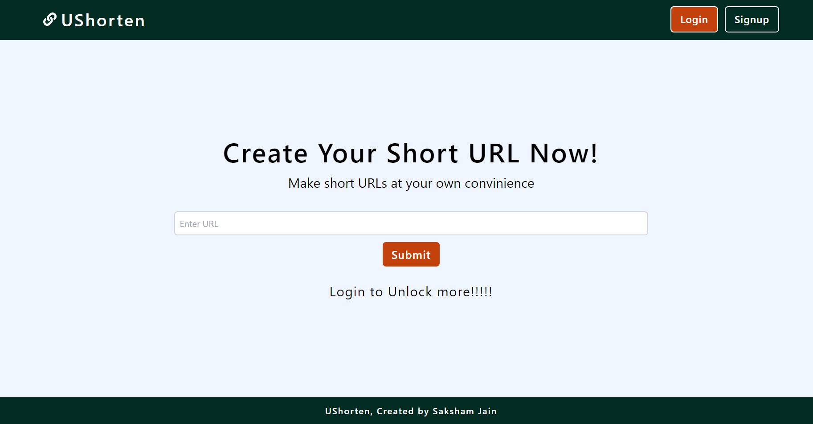

# UShorten - URL Shortener

UShorten is a URL shortening web application built with the MERN stack (MongoDB, Express.js, React.js, and Node.js). It allows users to shorten long URLs into shorter, more manageable links. Additionally, UShorten supports Google authentication, providing users with the option to sign in using their Google accounts.

## Features

- Shorten long URLs to create shorter, more user-friendly links.
- Secure user authentication using JWT tokens.
- Google authentication for seamless login with Google accounts.
- User-friendly interface built with React.js.
- Backend API built with Express.js and MongoDB for data storage.
- Password hashing for secure user authentication.

## Installation

To run UShorten locally, follow these steps:

1. Clone this repository:

```bash
git clone https://github.com/your-username/UShorten.git
```
2. Navigate into the project directory:
```bash
cd UShorten
```

3. Install dependencies for both the frontend and backend:
```bash
cd frontend && npm install
cd ..
cd backend && npm install
cd ..

```

4. Create a .env file in the frontend directory and set the following environment variables:

```env
VITE_REACT_BACKEND_URL = "http://locahost:port"
```

5. Create a .env file in the frontend directory and set the following environment variables:
```
MONGO_DB_LOCAL_URI = "Your_Mongo_URI"
JWT_SECRET = 'Your_JWT_Secret'
GOOGLE_CLIENT_ID = 'Your Google Client ID'
GOOGLE_CLIENT_SECRET = 'Your Google Client Secret'
```

6. Start the development server:
```bash
cd backend && npm start
```

7. Start the development frontend:
```bash
cd frontend && npm run dev
```

## Contributing
Contributions are welcome! Feel free to submit pull requests or open issues if you encounter any bugs or have suggestions for improvements.

## Deployments
- The project is deployed on vercel - https://u-shorten-tan.vercel.app/

